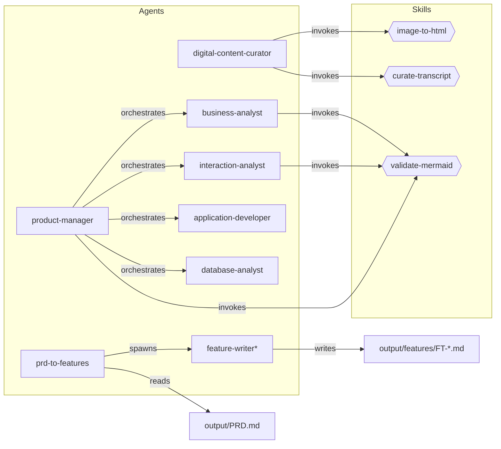
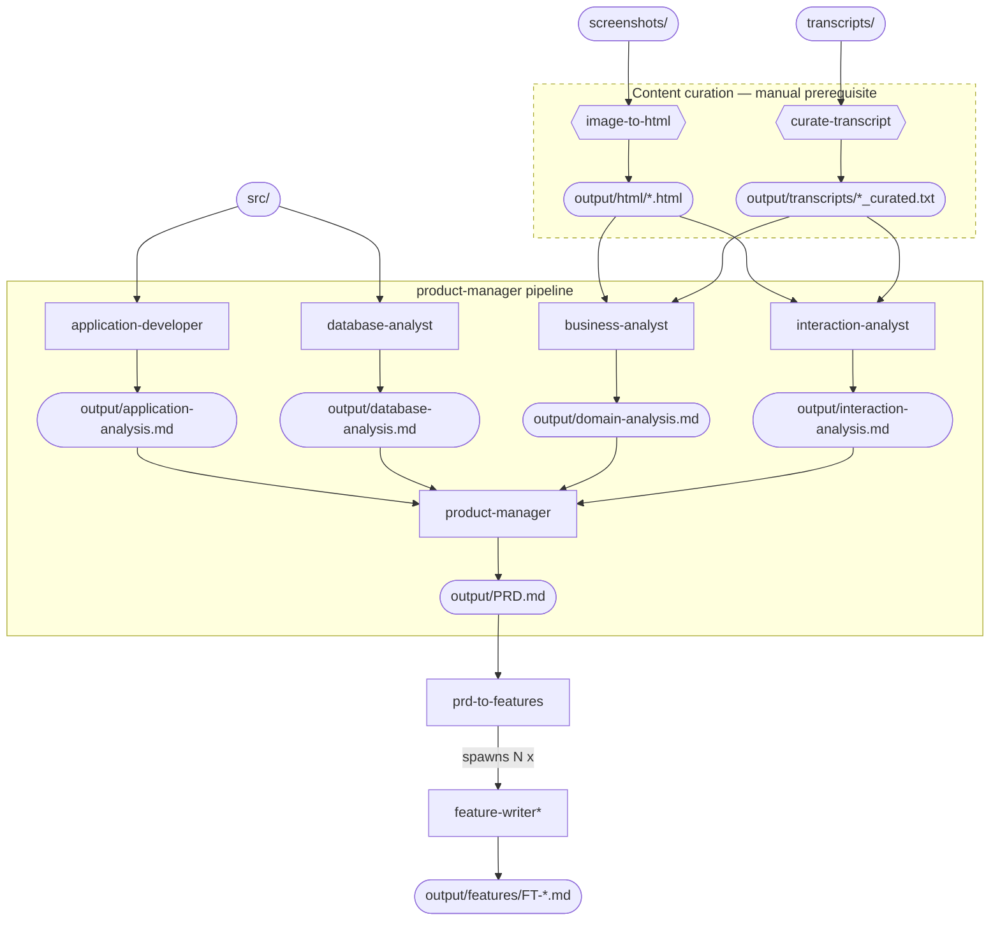

# Claude Legacy Reverse Engineering Plugin


A Claude Code plugin for Defra's Legacy Application Programme (LAP) to aid in the reverse engineering of legacy applications.

## Purpose

This plugin extends Claude Code with specialised tooling and prompts to assist engineers in understanding, documenting, and modernising legacy systems within Defra's estate.

## Data Classification

**This plugin must only be used on source material classified as OFFICIAL.** Do not use it with material at any higher classification. If you are unsure about the classification of your source material, seek guidance from your organisation before proceeding.

By default, Claude Code sends data to models hosted by Anthropic. Claude Code can also be configured to use [Amazon Bedrock](https://docs.aws.amazon.com/bedrock/) or [Google Cloud Vertex AI](https://cloud.google.com/vertex-ai) — consult your organisation's guidance on approved platforms.

## Permissions

Claude Code prompts for approval before executing tools such as shell commands and file writes. The `--dangerously-skip-permissions` flag bypasses these prompts, allowing fully unattended operation (e.g. in the batch curation script below).

If you use this flag, run Claude Code inside a containerised sandbox (Docker, Podman, or a [devcontainer](https://code.claude.com/docs/en/devcontainer)) so that any unintended actions are contained. If a sandbox is not available, omit the flag and approve each action manually instead.

## Prerequisites

- [Claude Code](https://docs.anthropic.com/en/docs/claude-code) installed and authenticated
- Bash 4+
- `jq` (for parsing Claude output in the `reveng` CLI)
- For `reveng sandbox` only: Docker and the [`devcontainer` CLI](https://github.com/devcontainers/cli) (`npm install -g @devcontainers/cli`)

## Installation

The repository ships with a `reveng` CLI that wraps the plugin in a set of command-driven workflows. See [`specs/reveng-cli.md`](specs/reveng-cli.md) for the full specification.

```bash
git clone https://github.com/DEFRA/claude-legacy-reveng-plugin
cd claude-legacy-reveng-plugin
./install.sh
```

`install.sh` copies files to:

| Source | Destination |
|--------|------------|
| `reveng` | `~/.local/bin/reveng` |
| `skills/`, `agents/`, `hooks/`, `.claude-plugin/`, `CLAUDE.md` | `~/.config/reveng/plugin/` |
| `container/Dockerfile`, `container/devcontainer.json` | `~/.config/reveng/container/` |

Override the destinations with the `REVENG_BIN_DIR` and `REVENG_CONFIG_DIR` environment variables. `install.sh` refuses to overwrite an existing installation by default — pass `--update` to upgrade in place:

```bash
./install.sh --update
```

After installation, verify with:

```bash
reveng version    # prints: reveng 0.1.0
```

If `~/.local/bin` is not already on your `PATH`, add it to your shell profile:

```bash
export PATH="$HOME/.local/bin:$PATH"
```

### Uninstall

There is no dedicated uninstall command. Remove the installed files manually:

```bash
rm ~/.local/bin/reveng
rm -rf ~/.config/reveng
```

## CLI Commands

All `reveng` commands run headlessly — they invoke Claude Code in `--dangerously-skip-permissions` mode with the plugin loaded from `~/.config/reveng/plugin/`. When run outside a devcontainer, a safety warning is printed to stderr. Use `reveng sandbox` (below) to run commands inside an isolated container.

| Command | Purpose |
|---------|---------|
| `reveng init` | Scaffold `screenshots/`, `transcripts/`, `src/`, `output/` and add the intermediate-output entries to `.gitignore` |
| `reveng curate` | Run the `digital-content-curator` agent to prepare screenshots and transcripts for analysis (default model: `sonnet`) |
| `reveng synthesise` | Run the `product-manager` agent to produce `output/PRD.md` from curated content (default model: `opus`) |
| `reveng decompose` | Run the `prd-to-features` agent to decompose `output/PRD.md` into `output/features/FT-*.md` (default model: `opus`) |
| `reveng sandbox` | Start or attach to a devcontainer for the current project (supports `--rebuild` and `clean` subcommand) |
| `reveng version` | Print the CLI version and exit |
| `reveng help` | Print usage information |

### Global flags

These flags are accepted by the `curate`, `synthesise`, and `decompose` commands:

| Flag | Default | Description |
|------|---------|-------------|
| `-m, --model MODEL` | varies by command | Claude model to use |
| `-v, --verbose` | off | Show Claude commands and raw output |
| `--dry-run` | off | Print the `claude` command that would run without executing it |
| `-h, --help` | | Show command-specific help |

### Prerequisites between stages

Each stage validates its inputs before invoking Claude and points the user at the preceding command if something is missing:

| Command | Requires |
|---------|----------|
| `curate` | At least one file in `screenshots/` or `transcripts/` |
| `synthesise` | At least one `output/html/*.html` and one `output/transcripts/*_curated.txt` (run `reveng curate` first) |
| `decompose` | `output/PRD.md` exists (run `reveng synthesise` first) |

### `reveng sandbox` workflow

`reveng sandbox` provides a containerised environment so Claude Code can run with `--dangerously-skip-permissions` safely. The container is a Node 20 image with Claude Code and standard dev tools preinstalled, and it mounts the current workspace, the installed `reveng` binary, the plugin content, and (optionally) your SSH keys, GitHub CLI auth, and SSH agent socket.

```bash
cd my-legacy-app
git init                    # the sandbox requires a git repository
reveng init                 # scaffold project directories
reveng sandbox              # start or attach to the project's container
# inside the container:
node@sandbox:/workspace$ reveng curate
node@sandbox:/workspace$ reveng synthesise
node@sandbox:/workspace$ reveng decompose
node@sandbox:/workspace$ exit

reveng sandbox --rebuild    # force a fresh image build
reveng sandbox clean        # remove the project's container
```

## Local Development

The plugin is entirely file-based (Markdown and JSON) — there is no build step. Changes to skills, hooks, and configuration are picked up on the next session start.

### Running the plugin locally

```bash
claude --plugin-dir /path/to/claude-legacy-reveng-plugin
```

Or add a shell alias for convenience:

```bash
alias claude-lap='claude --plugin-dir /path/to/claude-legacy-reveng-plugin'
```

### Development workflow

1. Edit a skill, hook, or config file in your editor
2. Start a new Claude Code session with `--plugin-dir` pointing at your local clone
3. Verify the plugin loaded with `/skills` or `/mcp` inside the session
4. Test your changes (e.g. `/defra-legacy-reveng:skill-name`)
5. Iterate — exit the session, tweak files, relaunch

### Tips

- **Skills** are Markdown files — edit and relaunch, nothing to compile.
- **Hooks** run shell commands — test them standalone in your terminal before wiring them into `hooks/hooks.json`.
- **MCP servers**, if added later, are the only component that may require a build step.

## Project Structure

```
claude-legacy-reveng-plugin/
├── .claude-plugin/
│   └── plugin.json       # Plugin manifest
├── skills/               # Reverse engineering skills (slash commands)
├── hooks/
│   └── hooks.json        # Hook configuration
├── agents/               # Custom subagent definitions
├── CLAUDE.md             # Plugin-level context for Claude
└── README.md
```

## Input and Output

Place your raw material in the host project (the project you run the plugin from) using the directory layout below. The plugin's skills and agents expect these locations.

### Inputs (you provide)

| Directory | Contents |
|-----------|----------|
| `screenshots/` | UI screenshots of the legacy application (`.png`, `.jpg`, `.jpeg`, `.gif`, `.bmp`, `.webp`) |
| `transcripts/` | Stakeholder interview transcripts (`.txt`) |
| `src/` | Legacy application source code (`.sln`, `.vbproj`, `.csproj`, `.vb`, `.cs`, `.aspx`, `.ascx`, `.asmx`, `.cshtml`, `.Master`, `.resx`, `.config`, `.json`, `.sql`, `.sqlproj`, `.rpt`, `.rdl`, `.rdlc`) |

### Outputs (generated by the plugin)

| Path | Produced by | Description |
|------|------------|-------------|
| `output/html/*.html` | `image-to-html` | Semantic HTML mockup of each screenshot |
| `output/transcripts/*_curated.txt` | `curate-transcript` | Interview transcripts with off-topic content removed (intermediate) |
| `output/domain-analysis.md` | `business-analyst` | Comprehensive domain analysis (ubiquitous language, bounded contexts, subdomains, context map) extracted from curated transcripts and HTML mockups |
| `output/interaction-analysis.md` | `interaction-analyst` | Comprehensive interaction analysis (screen inventory, user workflows with mermaid diagrams, screen navigation map) stitched from HTML mockups and curated transcripts |
| `output/application-analysis.md` | `application-developer` | Comprehensive application analysis (workflows, behaviours, domain model, business rules, reports) extracted from source code |
| `output/database-analysis.md` | `database-analyst` | Comprehensive database analysis (schema, stored procedures, triggers, constraints, database-level business rules) extracted from SQL and source code |
| `output/PRD.md` | `product-manager` | Comprehensive Product Requirements Document synthesised from all analysis outputs |
| `output/features/FT-XXX-*.md` | `prd-to-features` agent | Individual feature specifications decomposed from the PRD, each with user stories, wireframes, and acceptance criteria |

### Output management

Generated outputs are regeneratable artefacts. Recommended version control approach:

**Commit to version control:**
- `output/PRD.md` — the final deliverable
- `output/features/FT-*.md` — individual feature specifications decomposed from the PRD
- `output/domain-analysis.md`, `output/interaction-analysis.md`, `output/application-analysis.md`, `output/database-analysis.md` — the four analysis files

**Add to `.gitignore` (intermediate/regeneratable):**

```gitignore
# Plugin intermediate outputs
output/html/
output/transcripts/
```

## Component Map

Rectangles are agents, hexagons are skills. Arrows show invocation relationships.



## Skills

| Skill | Description |
|-------|-------------|
| `image-to-html` | Converts a legacy UI screenshot into semantic, unstyled mockup HTML |
| `curate-transcript` | Removes off-topic content from interview transcripts |
| `validate-mermaid` | Validates all Mermaid diagram blocks in a markdown file and fixes broken diagrams in place |

## Agents

| Agent | Description |
|-------|-------------|
| `digital-content-curator` | Prepares raw screenshots and interview transcripts into structured, analysis-ready outputs (HTML mockups, curated transcripts) |
| `business-analyst` | Extracts strategic DDD patterns (ubiquitous language, bounded contexts, subdomains, context map) from curated transcripts and HTML mockups for PRD generation |
| `interaction-analyst` | Stitches HTML mockups with curated interview transcripts to produce comprehensive interaction analysis (screen inventory, user workflows, screen navigation map) for PRD generation |
| `application-developer` | Comprehensively reads legacy .NET source code under `src/` to extract workflows, behaviours, domain model, business rules, and reports for PRD generation |
| `database-analyst` | Comprehensively reads legacy SQL Server database code under `src/` to extract schema, stored procedures, triggers, constraints, and database-level business rules for PRD generation |
| `product-manager` | Synthesises all analysis outputs (domain, interaction, codebase, database) into a comprehensive Product Requirements Document for implementation planning. Requires curated content as a prerequisite |
| `prd-to-features` | Decomposes a PRD into individually deliverable feature specifications by spawning parallel `feature-writer` agents. Each feature includes user stories, wireframes, acceptance criteria, and effort estimates |
| `feature-writer` *(internal)* | Worker agent spawned by `prd-to-features`. Writes a single feature specification file using the 21-section LAP feature template. Not for direct use. |

## Pipeline

The pipeline has three phases. Content curation is a manual prerequisite — run it first using the `digital-content-curator` agent or the bash script (see Troubleshooting). Once curated content exists, the `product-manager` orchestrates the analysis and synthesis stages to produce the PRD. After reviewing the PRD, run the `prd-to-features` agent to decompose it into individually deliverable feature specifications. In the diagram below, rectangles are agents, hexagons are skills, stadium shapes are files, and the dashed border marks manual phases.



| Stage | Components | Runs in parallel with |
|-------|------------|-----------------------|
| Prerequisite — Content curation (manual) | `image-to-html` and `curate-transcript` skills | Run before launching `product-manager` |
| 1 — Code analysis | `application-developer` and `database-analyst` read `src/` independently | Stage 2 |
| 2 — Content analysis | `business-analyst` and `interaction-analyst` consume curated outputs | Stage 1 |
| 3 — Synthesis | `product-manager` reads all four analyses and writes `output/PRD.md` | None; depends on Stages 1 and 2 |
| 4 — Feature decomposition (manual) | `prd-to-features` agent reads `output/PRD.md` and writes individual feature specs to `output/features/` | Run after reviewing the PRD |

## Troubleshooting

### Content curation stalls on large file sets

The `digital-content-curator` agent processes files sequentially within a single Claude session. When the number of screenshots or transcripts is large (e.g. 50+), the session may exhaust its turn budget before finishing all files.

If this happens, bypass the agent and invoke the skills directly from a bash loop. Each iteration runs its own Claude process with a fresh context window, so there is no turn budget limit:

```bash
#!/usr/bin/env bash
CLAUDE="claude --plugin-dir /path/to/claude-legacy-reveng-plugin --model claude-sonnet-4-20250514 --dangerously-skip-permissions"

# Process screenshots
for img in screenshots/*.{png,jpg,jpeg,gif,bmp,webp}; do
  [ -f "$img" ] || continue
  name="${img##*/}"
  name="${name%.*}"
  [ -f "output/html/${name}.html" ] && echo "Skipping $img (already done)" && continue
  echo "Processing $img..."
  $CLAUDE -p "/image-to-html $img" \
    --allowedTools "Read,Write,Bash(mkdir*)"
done

# Process transcripts
for txt in transcripts/*.txt; do
  [ -f "$txt" ] || continue
  [[ "$txt" == *_curated.txt ]] && continue
  name="${txt##*/}"
  name="${name%.txt}"
  [ -f "output/transcripts/${name}_curated.txt" ] && echo "Skipping $txt (already done)" && continue
  echo "Processing $txt..."
  $CLAUDE -p "/curate-transcript $txt" \
    --allowedTools "Read,Edit,Bash(mkdir*;cp*)"
done
```

The skip logic makes this resumable — re-run the script and it picks up where it left off.

## Status

Early development.
